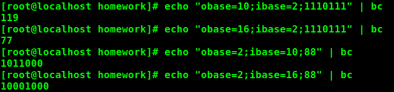

# CWorkSpace
###update 2016.04.08
---
####MacOS 快速进制转换

```

echo "obase=输出进制数;ibase=输入进制数;要转换的数字" | bc

```




======
1、short <= int <= long <= long long

2、c99标准，在c 中最小的数据类型是[_Bool](http://bbs.fishc.com/forum.php?mod=viewthread&tid=67033&extra=page%3D1%26filter%3Dtypeid%26typeid%3D571)

3、printf（）是函数   ，sizeof()是运算符

4、c99 一个字节呗定义为连续的比特为，具体大小由环境决定，通常约定俗称一个字节等于8个比特位。1Byte == 8bit

5、c标准只规定char字符型的具体尺寸（其他的数据类型是相对范围,具体大小实现依赖环境）

6、sizeof运算符后面如果跟一个类型，那么需要加小括号 如 sizeof(int)  sizeof 234

7、unsigned int  可以比 int 表示更大的整数，因为带符号的需要一半的存储空间来存放负数: